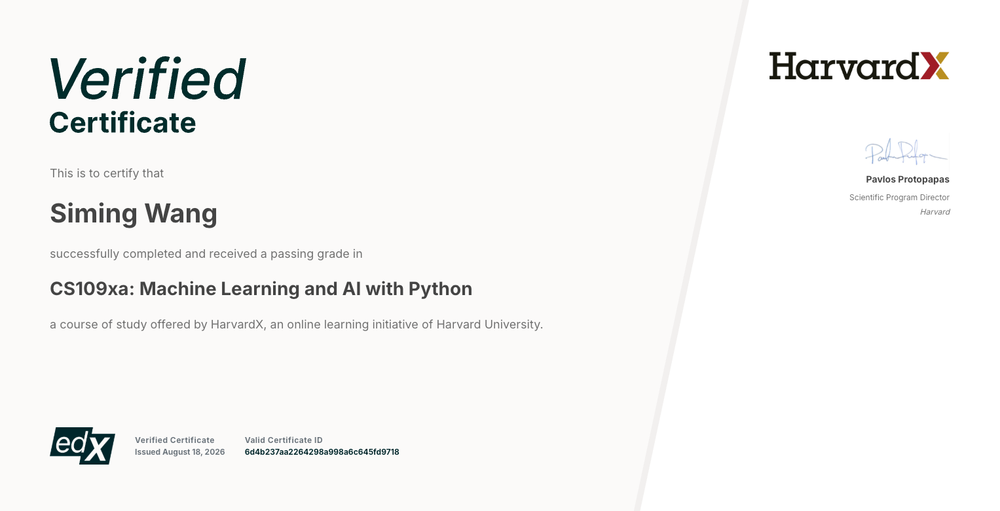
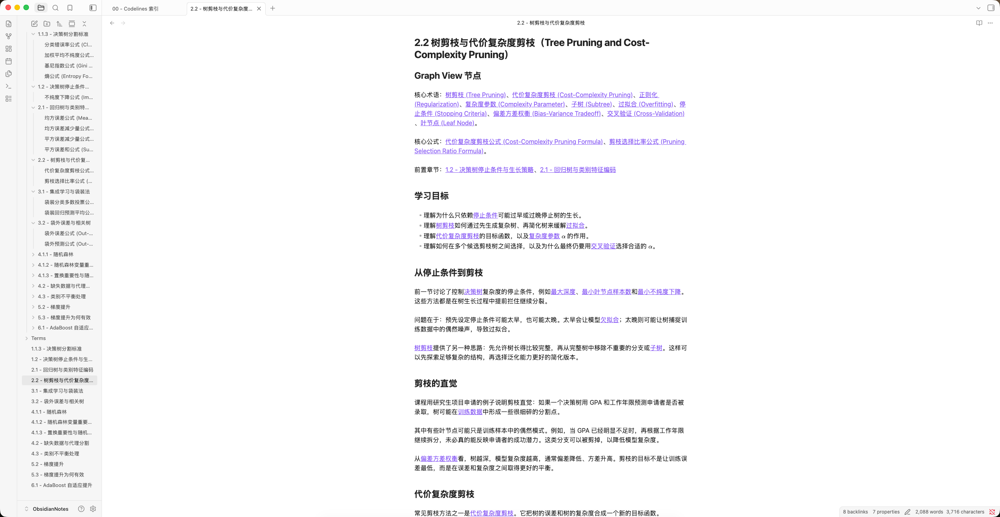
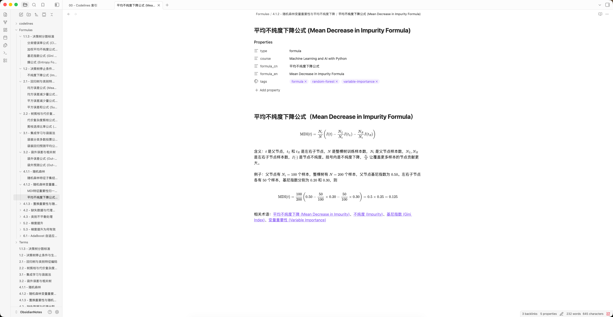
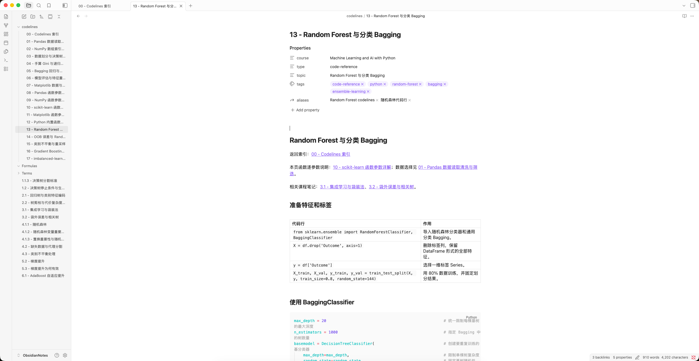
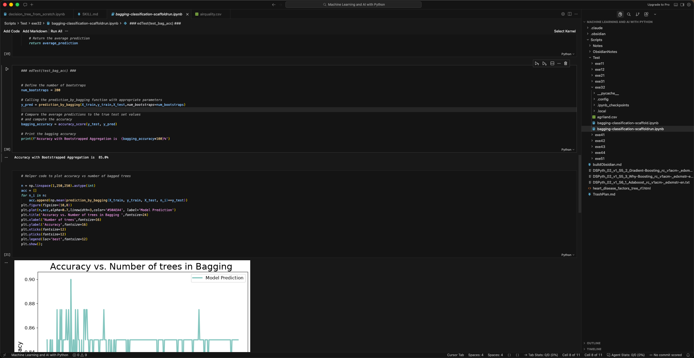

# Course Learning Vault Skill

> 把课程转写稿和文字资料整理成结构化、可链接、可复习的 Obsidian 学习知识库。

我使用这套方法学习并完成了 HarvardX CS109xa《Machine Learning and AI with Python》，最终获得 Verified Certificate：



## 只下载这个 Skill（不下载示例仓库）

本仓库中真正需要安装的只有 [`Course-learning-Vault Skill/`](https://github.com/WSMYKM3/Course-learning-Vault-Skill/tree/main/Course-learning-Vault%20Skill)。`Scripts/` 下的内容是示例课程资料和产出，不是 Skill 的运行依赖。

### 方法一：交给你喜欢的 Agent 安装（推荐）

把下面这段请求发送给你常用、且支持 Agent Skills 的 AI Agent：

```text
请从下面的 GitHub 子目录安装或加载 course-learning-vault Skill。
只获取这个 Skill 目录，不要下载 Scripts 等示例内容：
https://github.com/WSMYKM3/Course-learning-Vault-Skill/tree/main/Course-learning-Vault%20Skill
```

不同 Agent 的 Skill 目录、安装命令和加载方式可能不同，请以你所用 Agent 的说明为准。安装完成后，在新会话中指定使用 `course-learning-vault` 即可。

### 方法二：用 Git sparse checkout 只检出 Skill

```bash
git clone --depth 1 --filter=blob:none --sparse \
  https://github.com/WSMYKM3/Course-learning-Vault-Skill.git \
  course-learning-vault-download

git -C course-learning-vault-download sparse-checkout set "Course-learning-Vault Skill"
```

Skill 位于：

```text
course-learning-vault-download/Course-learning-Vault Skill/
```

将这个目录复制到你所用 Agent 的 Skills 目录即可；具体目标路径以该 Agent 的文档为准。

## 这个项目是什么

Course Learning Vault 是一个面向课程学习的 Agent Skill。它不会把转写稿简单地“润色成 Markdown”，而是以课程原本的教学逻辑为主线，把资料整理成一个可理解、可检索、可复习的 Obsidian 知识系统。

它可以帮助你：

- 从 `.txt`、`.md`、粘贴文本或字幕式转写稿生成章节笔记；
- 为每门课程建立独立的 Course Map 和目录结构；
- 提取值得长期复用的概念、公式和方法，建立 canonical node；
- 用 Obsidian WikiLinks 连接章节、术语、公式、方法与代码参考；
- 为章节生成学习目标、常见误区、折叠答案的复习检查和一句话总结；
- 在模块结束时生成 checkpoint review 或综合测验；
- 审核 metadata、失效链接、重复节点、孤立笔记和 MathJax 问题。

所有产物都使用标准 Markdown、YAML frontmatter、Obsidian WikiLinks、callout 和 MathJax，不依赖 Obsidian 社区插件。

## 它如何组织一门课

新课程默认使用下面的结构：

```text
00 - Course Map.md
Lessons/
Concepts/
Formulas/
Methods/
Reviews/
Quizzes/
```

只有课程确实需要时，才会增加 `Theorems/`、`Proofs/`、`Code/` 或 `Examples/`，不会为了目录看起来完整而创建空文件夹。

| 内容 | 作用 |
| --- | --- |
| Course Map | 课程主页与配置中心，记录章节入口、状态、知识索引和待复习内容 |
| Lessons | 保留教学推理顺序的章节笔记，而不是清洗后的逐字稿 |
| Concepts / Terms | 可独立检索、会跨章节复用的核心概念 |
| Formulas | 公式、符号说明、适用条件、计算例子和相关知识链接 |
| Methods | 可重复使用的问题解决方法、输入输出、步骤与限制 |
| Code | 值得独立复用的代码模式或 API 参考，仅在课程需要时创建 |
| Reviews / Quizzes | 跨章节复习、知识依赖、易混点比较和自测题 |

对于已经存在的 Obsidian vault，Skill 会先识别原有目录和 metadata，不会未经允许批量迁移、改名或覆盖用户笔记。

## 工作方式

1. 读取课程资料、目标 vault、已有 Course Map 和相关笔记。
2. 清理时间戳、字幕断句与无意义重复，同时保留例子、限制条件和教学顺序。
3. 重建课程的推理主线：学习目标、核心问题、前置知识、公式、方法与常见误区。
4. 搜索已有节点和中英文别名，优先复用 canonical node，避免重复创建同一概念。
5. 生成章节笔记，并在正文中链接相关概念、公式、方法和相邻章节。
6. 添加适量的复习检查；只有用户明确确认时才把内容标记为“已掌握”。
7. 更新 Course Map，并运行只读审计检查 vault 的结构质量。

课程内容始终是教学主线。若需要纠正转写错误或补充外部知识，Skill 会把它明确标记为“转写纠正”“补充”或“待核验”，不会悄悄把外部内容写成老师原本讲过的内容。

## 示例：Machine Learning and AI with Python

这个仓库使用我学习 HarvardX CS109xa《Machine Learning and AI with Python》的过程作为示例。仓库里的其他文件主要用于展示这个 Skill 能生成怎样的课程笔记结构，而不是 Skill 本身的一部分。

当前示例 vault 位于 [`Scripts/ObsidianNotes/`](Scripts/ObsidianNotes/)，采用被 Skill 兼容保留的早期目录结构：章节笔记在根目录，原子节点分别放在 `Terms/`、`Formulas/` 和 `codelines/` 中。

当前示例包括：

- 14 篇章节主笔记；
- 139 个术语节点；
- 37 个公式节点；
- 18 篇代码参考笔记。

### 章节课件与知识节点

章节笔记集中列出核心术语、核心公式和前置章节，并在正文中通过双链继续连接相关知识。这样既能顺序学习，也能从 Obsidian Graph View 沿概念关系回顾课程。



### 公式管理

公式会被拆成独立节点，包含 MathJax 公式、符号解释、适用语境、具体计算例子、相关术语和来源章节。公式因此不仅“出现在课件里”，也可以被多个章节复用和单独复习。



### 代码参考

当代码模式值得跨章节复用时，可以创建独立的 code-reference 页面，将数据准备、模型调用、参数含义和相关课程章节连接起来。



### 课程练习材料

仓库保留了 `Scripts/Test/exe32/` 作为示例课程练习。它用于展示课程代码与笔记内容的对应关系，不是安装或运行 Skill 所必需的文件。



## 使用示例

### 建立一门新课程

```text
使用 $course-learning-vault，根据 ./Sources 中的课程资料建立一个新的 Obsidian 学习 vault。
课程名是「Machine Learning and AI with Python」，输出以中文为主，保留标准英文术语。
```

### 把一节转写稿整理成笔记

```text
使用 $course-learning-vault，把 lecture-03.txt 整理成课程笔记。
提取需要独立复习的概念、公式和方法，复用 vault 中已有节点，并更新 Course Map。
```

### 创建阶段复习或测验

```text
使用 $course-learning-vault，为第 1–4 章创建 checkpoint review 和一份中等难度综合测验。
重点比较容易混淆的概念，并给公式标注适用条件。
```

### 审核现有 vault

```text
使用 $course-learning-vault 审核这个 vault，只报告问题，不要自动修改。
```

也可以直接运行 Skill 自带的只读审计脚本：

```bash
python3 "Course-learning-Vault Skill/scripts/audit_vault.py" \
  "Scripts/ObsidianNotes"
```

如需机器可读的结果，增加 `--json`。

## 支持范围

适合：

- 有课程讲义、转写稿、字幕文本或 Markdown 资料；
- 希望把学习资料变成长期维护的知识网络；
- 需要章节笔记、术语/概念、公式、方法、复习和测验相互连接；
- 已有 Obsidian vault，希望在保留原结构的前提下继续整理。

不负责：

- 音频或视频转写；
- 与课程无关的通用笔记整理；
- 自动判断用户是否已经掌握某个知识点；
- 间隔重复排程或 Anki 导出。

## 项目结构

```text
.
├── Course-learning-Vault Skill/   # 可独立安装的 Agent Skill
│   ├── SKILL.md                   # 入口、路由与共享规则
│   ├── agents/openai.yaml         # Skill 展示信息与默认提示词
│   ├── references/                # Vault schema、课程工作流、来源与测验规范
│   └── scripts/                   # 只读 vault 审计器及测试
├── Scripts/
│   ├── ObsidianNotes/             # 示例课程的 Obsidian 笔记产出
│   ├── Test/exe32/                # 示例课程练习
│   └── images/                    # README 截图
└── LICENSE
```

## 设计原则

- 原始课程材料不修改；
- 课程的教学逻辑优先于逐句转录；
- 只为值得检索和复用的内容创建原子节点；
- 先搜索、再复用，避免同义概念重复建页；
- 不伪造事实、公式、来源、未来章节链接或掌握状态；
- 审计结果是需要人工判断的证据，不是自动重写 vault 的授权。

## License

本项目采用 [MIT License](LICENSE)。
